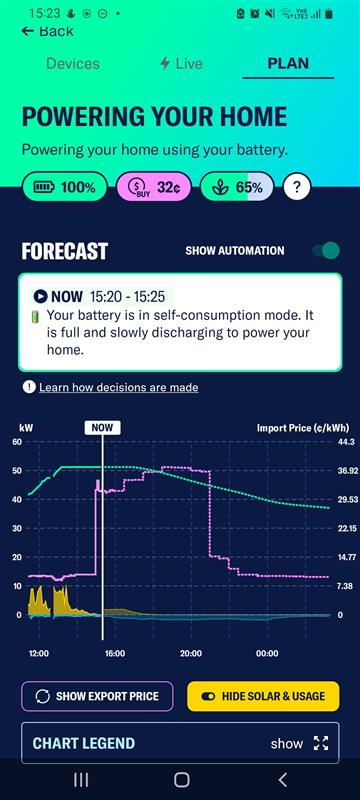

# ELEC9715 Project: Amber VPP Data Processing

## Background
- Amber provides example systems (pulled from their customers).
- This shows operation and control of the 'VPP' at a household level.
- Want to use this to reverse engineer/estimate their VPP algorithm.
- Through the app, can see data from three households.
- At the moment only able to access through plot screenshots.
- There is an [api](https://github.com/amberelectric/public-api) available that we could try work with to pull data.
- Alternatively, need to take a bunch of screenshots and convert to a useful format.

## Data available from Amber/What we want to record
- Three households: VIC (3000), NSW (2000), QLD (4000).
- Vic is most important as it matches household data from assignment 1.

Each plot contains the following time series data:

**Power (kW)**
- PV generation level
- Demand level
- Battery level

**Price (c/kWh)**
- Import: Customer cost of pulling electricity from grid.
- Export: Customer revenue from sending electricity into grid.

- These are shown on separate plots.

**Historical and Projected**
- Each plot shows 4hrs of historical data (before current time).
- Also contains (dashed line) 12hrs of projected data.

**Additional info: Live tab**
- Resets at midnight, cumulates daily
- Total cost ($/day)
    - Import costs
    - Export earnings
- Total PV gen (kWh)
- Battery net charge (kWh)
- House demand usage (kWh)
- Grid net imports (kWh), negative if export > import.

## Data processing
- Need to convert to a useful format.
    - csv of values
    - numpy array
    - dataframe (pandas)

Rough steps:
1. Crop screenshots so plots are in the same spot.
2. Split into different colours for each trace/time series.
3. Convert to monochrome.
4. Process using existing python libraries.
5. Save data for each screenshot.
6. Combine into one continuous set of time series for each household.

Possible existing python for image processing:
[plot digitizer](https://pypi.org/project/plotdigitizer/)
[bitmap extraction](https://medium.com/@sanic_the_hedgefond/scraping-information-out-of-raw-pixeldata-with-python-4bf34641b6c3)

